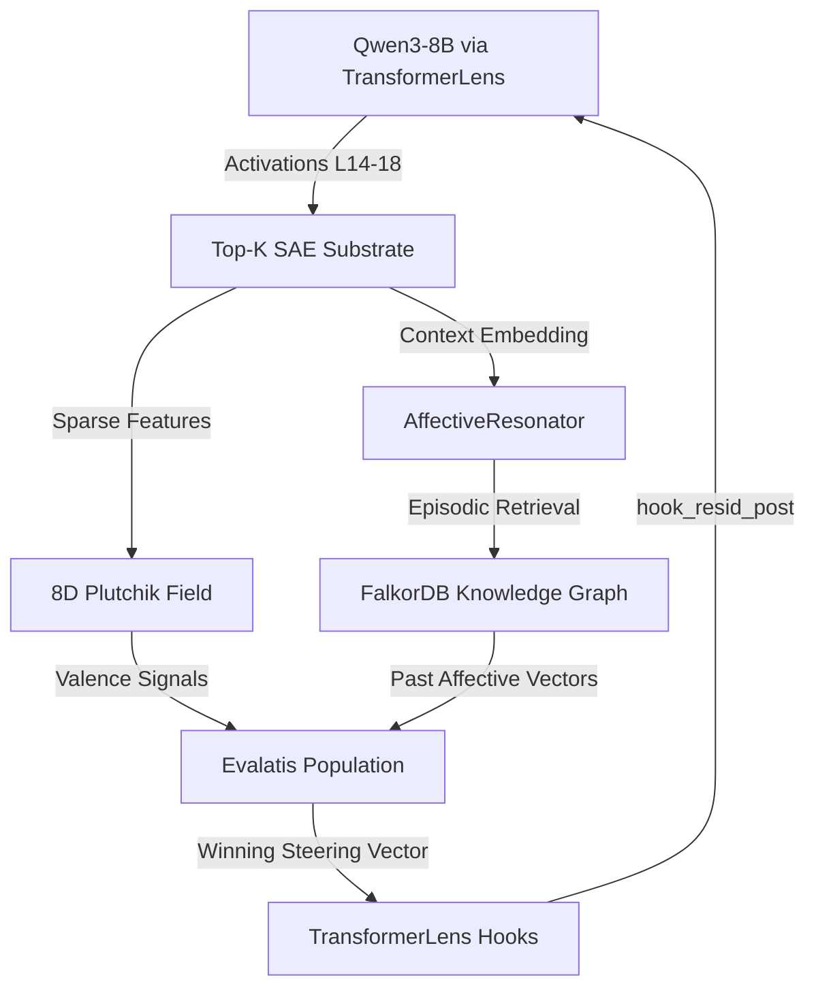

# Lilly: Self-Steering Cognitive AI via Evolutionary SAE Activation Steering

 
*Note: Paper "Self-Steering Cognitive AI: Evalatis, Active Inference, and 8D Affect Steering in Live LLM Systems" currently in preprint.*

Lilly is an experimental cognitive architecture built on **Qwen3-8B** that utilizes **Sparse Autoencoders (SAEs)** not just for analysis, but as a live perceptual and control substrate. By integrating evolutionary activation steering with a dimensional emotional field, Lilly closes the loop between internal state representation and behavioral generation.

## 🚀 Core Research Contributions

### 1. Evalatis: Evolutionary Activation Steering
Unlike static activation steering (e.g., CAA), **Evalatis** maintains a live population of steering vectors that evolve in real-time.
*   **Crystallization:** Steering vectors are dynamically extracted from statistical regularities in the SAE feature basis during inference.
*   **Crossover:** High-fitness vectors (measured by semantic affinity and prediction error reduction) reproduce via **blend-with-mutation** operators.
*   **Selection:** A non-stationary fitness landscape driven by the **Free Energy Principle (FEP)** ensures the steering population adapts to the model's current behavioral regime.

### 2. High-Fidelity Concept Injection
Following the methodology of **Lindsey et al. (2025)**, Lilly treats steering as a form of "naturalistic" concept injection. 
*   **Substrate:** 163,840-feature **Top-K SAE** trained on Qwen3-8B MLP layers via `SAELens`.
*   **Basis:** Every steering vector is expressed in the sparse SAE feature basis, ensuring that interventions target semantic concepts rather than arbitrary directions in activation space.

### 3. Affective Grounding (8D Plutchik Field)
Lilly maintains a continuous 8-dimensional emotional field. Secondary emotions emerge via **wave-packet interference** between primary axes (Joy, Trust, Fear, Surprise, Sadness, Disgust, Anger, Anticipation). This field provides the persistent "internal context" for the **AffectiveResonator** memory system.

---

## 🏗️ Architecture

---

## 🛠️ Technical Stack

- **Model:** Qwen3-8B (Open weights)
- **Interpretability:** `TransformerLens` (hooks), `SAELens` (SAE training/inference)
- **Memory:** `FalkorDB` (Graph-based episodic memory)
- **Framework:** `Active Inference` / `Free Energy Principle` (Valence computation)

## 📊 Preliminary Results: The Introspection Gap

We are currently benchmarking Lilly against the results in *Emergent Introspective Awareness in Large Language Models (2025)*. 

Preliminary observations suggest that **Affective Grounding** significantly improves the **Affective Alignment Score (AAS)**—the model's ability to accurately detect and report on its own internal steering—compared to the 20% baseline reported for ungrounded concept injection.

---

## 📜 References

1. **Templeton et al. (2024).** *Scaling Monosemanticity: Extracting Interpretable Features from Claude 3 Sonnet.* Anthropic.
2. **Lindsey et al. (2025).** *Emergent Introspective Awareness in Large Language Models.* Anthropic.
3. **Gao et al. (2024).** *Scaling and Evaluating Sparse Autoencoders.* OpenAI.
4. **Parr, Pezzulo, & Friston (2022).** *Active Inference: The Free Energy Principle in Mind, Brain, and Behavior.* MIT Press.

---

## 🤝 Contact

**Ryan Mulligan**  
[ryan@mulligan.dev](mailto:ryan@mulligan.dev) | [LinkedIn](https://linkedin.com/in/rmulligan)  
*Staff AI Systems Architect / Engineering Leader*
